# AWAC MONO - Modèle Relationnel (ERD)

## Diagramme Entité-Relation Complet

```mermaid
erDiagram
    COMPETITIONS ||--o{ STEPS : contains
    COMPETITIONS ||--o{ COMPETITION_RESULTS : produces
    COMPETITIONS ||--o{ COMPETITION_STATUS_LOGS : logs
    COMPETITIONS ||--o{ SPECIAL_AWARDS : includes
    COMPETITIONS ||--o{ CERTIFICATE_TYPES : offers
    COMPETITIONS ||--o{ SYSTEM_SETTINGS : has
    
    STEPS ||--o{ FORMS : uses
    STEPS ||--o{ JURY_GROUP_STEPS : assigns
    STEPS ||--o{ STEP_CLOSURES : closes
    STEPS ||--o{ CANDIDATE_ASSIGNMENTS : allocates
    
    FORMS ||--o{ FORM_FIELDS : contains
    FORM_FIELDS ||--o{ FIELD_OPTIONS : provides
    FORMS ||--o{ FORM_RESPONSES : receives
    
    FORM_RESPONSES ||--o{ FORM_RESPONSE_VALUES : contains
    FORM_RESPONSE_VALUES ||--o{ FIELD_OPTIONS : references
    
    CRITERIA ||--o{ CANDIDATE_SCORES : evaluates
    
    CANDIDATES ||--o{ CANDIDATE_PHOTOS : has
    CANDIDATES ||--o{ CANDIDATE_ASSIGNMENTS : participates
    CANDIDATES ||--o{ CANDIDATE_SCORES : receives
    CANDIDATES ||--o{ CANDIDATE_COMMENTS : receives
    CANDIDATES ||--o{ CANDIDATE_SUGGESTIONS : receives
    CANDIDATES ||--o{ PUBLIC_VOTES : targets
    CANDIDATES ||--o{ COMPETITION_RESULTS : appears_in
    CANDIDATES ||--o{ CERTIFICATES : obtains
    
    PROFILES ||--o{ JURY_GROUP_MEMBERS : joins
    PROFILES ||--o{ CANDIDATE_SCORES : submits
    PROFILES ||--o{ CANDIDATE_COMMENTS : writes
    PROFILES ||--o{ CANDIDATE_SUGGESTIONS : submits
    PROFILES ||--o{ PUBLIC_VOTES : casts
    PROFILES ||--o{ SIGNATURES : creates
    PROFILES ||--o{ AUDIT_LOGS : performs
    
    JURY_GROUPS ||--o{ JURY_GROUP_MEMBERS : contains
    JURY_GROUPS ||--o{ JURY_GROUP_STEPS : has
    JURY_GROUPS ||--o{ STEP_CLOSURES : closes
    JURY_GROUP_MEMBERS ||--o{ CANDIDATE_SCORES : submits
    JURY_GROUP_MEMBERS ||--o{ CANDIDATE_ASSIGNMENTS : evaluates
    JURY_GROUP_STEPS ||--o{ STEP_CLOSURES : finalized_by
    
    CANDIDATE_ASSIGNMENTS ||--o{ CANDIDATE_SCORES : scored
    CANDIDATE_ASSIGNMENTS ||--o{ CANDIDATE_COMMENTS : commented
    CANDIDATE_ASSIGNMENTS ||--o{ CANDIDATE_SUGGESTIONS : suggested
    
    CANDIDATE_SCORES ||--o{ AUDIT_LOGS : logged
    
    SPECIAL_AWARDS ||--o{ CERTIFICATES : grants
    
    CERTIFICATE_TYPES ||--o{ CERTIFICATE_TEMPLATES : defines
    CERTIFICATE_TEMPLATES ||--o{ CERTIFICATES : generates
    CERTIFICATES ||--o{ SIGNATURES : requires
    CERTIFICATES ||--o{ OFFICIAL_STAMPS : requires
    CERTIFICATES ||--o{ AUDIT_LOGS : logged
    
    PUBLIC_VOTES ||--o{ AUDIT_LOGS : logged
    COMPETITION_RESULTS ||--o{ NOTIFICATIONS : triggers
    
    NOTIFICATIONS ||--o{ AUDIT_LOGS : logged
    DASHBOARD_CACHE ||--o{ AUDIT_LOGS : logged
```

## Spécifications des Entités

### 1. COMPETITIONS
- **PK**: id (uuid)
- **Columns**:
  - name: varchar(255)
  - description: text
  - start_date: timestamp
  - end_date: timestamp
  - status: enum (planning, registrations, in_progress, closed)
  - logo_url: text
  - rules_document_url: text
  - max_candidates: integer (optional)
  - is_active: boolean
  - created_at: timestamp
  - updated_at: timestamp
  - created_by: uuid (FK → profiles)

### 2. STEPS
- **PK**: id (uuid)
- **FK**: competition_id (uuid → competitions)
- **Columns**:
  - name: varchar(255)
  - description: text
  - step_order: integer
  - percentage: numeric (0-100)
  - start_date: timestamp
  - end_date: timestamp
  - status: enum (draft, active, closed)
  - allows_dynamic_form: boolean
  - created_at: timestamp
  - updated_at: timestamp
- **Constraints**: percentage sum per competition = 100%

### 3. FORMS
- **PK**: id (uuid)
- **FK**: step_id (uuid → steps)
- **Columns**:
  - name: varchar(255)
  - description: text
  - form_type: enum (scoring, feedback, evaluation)
  - is_active: boolean
  - created_at: timestamp
  - updated_at: timestamp

### 4. FORM_FIELDS
- **PK**: id (uuid)
- **FK**: form_id (uuid → forms)
- **Columns**:
  - field_name: varchar(255)
  - field_type: enum (numeric, slider, checkbox, text_short, text_long, suggestion)
  - field_order: integer
  - is_required: boolean
  - min_value: numeric (for numeric/slider)
  - max_value: numeric (for numeric/slider)
  - description: text
  - placeholder: varchar(255)

### 5. FIELD_OPTIONS
- **PK**: id (uuid)
- **FK**: form_field_id (uuid → form_fields)
- **Columns**:
  - option_label: varchar(255)
  - option_value: varchar(255)
  - option_order: integer

### 6. FORM_RESPONSES
- **PK**: id (uuid)
- **FK**: form_id (uuid → forms)
- **FK**: candidate_assignment_id (uuid → candidate_assignments)
- **FK**: submitted_by (uuid → profiles)
- **Columns**:
  - submitted_at: timestamp
  - is_completed: boolean
  - created_at: timestamp
  - updated_at: timestamp

### 7. FORM_RESPONSE_VALUES
- **PK**: id (uuid)
- **FK**: form_response_id (uuid → form_responses)
- **FK**: form_field_id (uuid → form_fields)
- **FK**: field_option_id (uuid → field_options, nullable)
- **Columns**:
  - value: text
  - numeric_value: numeric (nullable)
  - text_value: text (nullable)
  - created_at: timestamp

### 8. CRITERIA
- **PK**: id (uuid)
- **FK**: step_id (uuid → steps)
- **Columns**:
  - name: varchar(255)
  - description: text
  - weight: numeric (0-1)
  - min_score: numeric
  - max_score: numeric
  - created_at: timestamp
  - updated_at: timestamp

### 9. CANDIDATES
- **PK**: id (uuid)
- **FK**: competition_id (uuid → competitions)
- **Columns**:
  - first_name: varchar(255)
  - last_name: varchar(255)
  - email: varchar(255)
  - phone: varchar(20)
  - unique_code: varchar(50) (unique per competition)
  - gender: enum (male, female, other)
  - category: varchar(100)
  - workshop_name: varchar(255)
  - commune: varchar(255)
  - registration_date: timestamp
  - status: enum (registered, approved, rejected, withdrawn)
  - created_at: timestamp
  - updated_at: timestamp
- **Indexes**: (competition_id, unique_code), gender, category

### 10. CANDIDATE_PHOTOS
- **PK**: id (uuid)
- **FK**: candidate_id (uuid → candidates)
- **Columns**:
  - photo_type: enum (profile, creation)
  - storage_path: text
  - file_size: integer
  - mime_type: varchar(50)
  - uploaded_at: timestamp
  - is_approved: boolean

### 11. PROFILES
- **PK**: id (uuid) (FK → auth.users)
- **Columns**:
  - email: varchar(255) (unique)
  - full_name: varchar(255)
  - avatar_url: text
  - phone: varchar(20)
  - role: enum (administrator, moderator, jury_president, jury_member)
  - is_active: boolean
  - last_login: timestamp
  - created_at: timestamp
  - updated_at: timestamp

### 12. JURY_GROUPS
- **PK**: id (uuid)
- **FK**: competition_id (uuid → competitions)
- **FK**: president_id (uuid → profiles) (nullable, can be set later)
- **Columns**:
  - name: varchar(255)
  - description: text
  - group_order: integer
  - created_at: timestamp
  - updated_at: timestamp
- **Constraint**: president_id must be a jury_president or be member of this group

### 13. JURY_GROUP_MEMBERS
- **PK**: id (uuid)
- **FK**: jury_group_id (uuid → jury_groups)
- **FK**: profile_id (uuid → profiles)
- **Columns**:
  - role: enum (member, president)
  - join_date: timestamp
  - is_active: boolean
- **Constraint**: Unique (jury_group_id, profile_id)
- **Constraint**: Exactly one president per jury_group

### 14. JURY_GROUP_STEPS
- **PK**: id (uuid)
- **FK**: jury_group_id (uuid → jury_groups)
- **FK**: step_id (uuid → steps)
- **Columns**:
  - assignment_date: timestamp
  - created_at: timestamp

### 15. CANDIDATE_ASSIGNMENTS
- **PK**: id (uuid)
- **FK**: candidate_id (uuid → candidates)
- **FK**: step_id (uuid → steps)
- **FK**: jury_group_id (uuid → jury_groups)
- **Columns**:
  - passage_order: integer (order in jury group)
  - assigned_date: timestamp
  - status: enum (pending, in_progress, completed, skipped)
  - created_at: timestamp
  - updated_at: timestamp
- **Constraint**: Unique (candidate_id, step_id, jury_group_id)

### 16. CANDIDATE_SCORES
- **PK**: id (uuid)
- **FK**: candidate_id (uuid → candidates)
- **FK**: step_id (uuid → steps)
- **FK**: criterion_id (uuid → criteria)
- **FK**: submitted_by (uuid → profiles)
- **Columns**:
  - score: numeric
  - jury_group_id: uuid (FK → jury_groups)
  - validated: boolean
  - validated_at: timestamp (nullable)
  - validated_by: uuid (FK → profiles, nullable)
  - is_edited: boolean
  - edited_at: timestamp (nullable)
  - edited_by: uuid (FK → profiles, nullable)
  - notes: text
  - created_at: timestamp
  - updated_at: timestamp
- **Constraint**: score must be within criterion min/max
- **Constraint**: Cannot edit if validated=true

### 17. CANDIDATE_COMMENTS
- **PK**: id (uuid)
- **FK**: candidate_id (uuid → candidates)
- **FK**: step_id (uuid → steps)
- **FK**: submitted_by (uuid → profiles)
- **Columns**:
  - comment: text
  - is_visible_to_candidate: boolean
  - created_at: timestamp
  - updated_at: timestamp

### 18. CANDIDATE_SUGGESTIONS
- **PK**: id (uuid)
- **FK**: candidate_id (uuid → candidates)
- **FK**: step_id (uuid → steps)
- **FK**: submitted_by (uuid → profiles)
- **Columns**:
  - suggestion: text
  - is_mandatory: boolean
  - created_at: timestamp
  - updated_at: timestamp

### 19. PUBLIC_VOTES
- **PK**: id (uuid)
- **FK**: candidate_id (uuid → candidates)
- **FK**: competition_id (uuid → competitions)
- **Columns**:
  - operator: enum (mtn, moov, celtis, demo)
  - transaction_reference: varchar(255) (nullable, for real payments)
  - phone_number: varchar(20) (nullable, for real payments)
  - amount: numeric
  - vote_date: timestamp
  - is_verified: boolean
  - created_at: timestamp
- **Constraint**: Unique (candidate_id, transaction_reference) when operator != demo
- **Note**: Conçu pour permettre intégration future Mobile Money

### 20. COMPETITION_RESULTS
- **PK**: id (uuid)
- **FK**: competition_id (uuid → competitions)
- **FK**: candidate_id (uuid → candidates)
- **Columns**:
  - jury_score: numeric
  - public_score: numeric
  - final_score: numeric
  - gender_rank: integer (male or female ranking)
  - overall_rank: integer (nullable, optional overall ranking)
  - status: enum (pending, finalized, published)
  - finalized_at: timestamp (nullable)
  - published_at: timestamp (nullable)
  - created_at: timestamp
  - updated_at: timestamp
- **Constraint**: Unique (competition_id, candidate_id)

### 21. SPECIAL_AWARDS
- **PK**: id (uuid)
- **FK**: competition_id (uuid → competitions)
- **Columns**:
  - name: varchar(255)
  - description: text
  - award_order: integer
  - created_at: timestamp
  - updated_at: timestamp

### 22. CERTIFICATE_TYPES
- **PK**: id (uuid)
- **FK**: competition_id (uuid → competitions)
- **Columns**:
  - name: varchar(255) (e.g., "Participation", "Merit")
  - description: text
  - is_active: boolean
  - created_at: timestamp
  - updated_at: timestamp

### 23. CERTIFICATE_TEMPLATES
- **PK**: id (uuid)
- **FK**: certificate_type_id (uuid → certificate_types)
- **Columns**:
  - template_name: varchar(255)
  - template_content: text (HTML or template format)
  - design_url: text
  - created_at: timestamp
  - updated_at: timestamp

### 24. CERTIFICATES
- **PK**: id (uuid)
- **FK**: candidate_id (uuid → candidates)
- **FK**: competition_id (uuid → competitions)
- **FK**: certificate_template_id (uuid → certificate_templates)
- **FK**: special_award_id (uuid → special_awards, nullable)
- **Columns**:
  - certificate_number: varchar(50) (unique)
  - status: enum (draft, pending_signature, signed, revoked)
  - issue_date: timestamp (nullable)
  - pdf_url: text (nullable)
  - is_locked: boolean
  - locked_at: timestamp (nullable)
  - locked_by: uuid (FK → profiles, nullable)
  - created_at: timestamp
  - updated_at: timestamp
- **Constraint**: Certificates blocked until competition closed
- **Index**: certificate_number, status

### 25. SIGNATURES
- **PK**: id (uuid)
- **FK**: certificate_id (uuid → certificates)
- **FK**: signer_id (uuid → profiles)
- **Columns**:
  - signature_type: enum (director, jury_president, moderator)
  - signature_data: text (digital signature)
  - signed_at: timestamp
  - created_at: timestamp

### 26. OFFICIAL_STAMPS
- **PK**: id (uuid)
- **FK**: certificate_id (uuid → certificates)
- **Columns**:
  - stamp_image_url: text
  - stamp_applied_at: timestamp
  - created_at: timestamp

### 27. NOTIFICATIONS
- **PK**: id (uuid)
- **FK**: recipient_id (uuid → profiles)
- **FK**: competition_id (uuid → competitions, nullable)
- **Columns**:
  - notification_type: enum (info, warning, success, error)
  - subject: varchar(255)
  - message: text
  - action_url: text (nullable)
  - is_read: boolean
  - read_at: timestamp (nullable)
  - created_at: timestamp

### 28. SYSTEM_SETTINGS
- **PK**: id (uuid)
- **FK**: competition_id (uuid → competitions)
- **Columns**:
  - setting_key: varchar(255)
  - setting_value: text
  - setting_type: enum (string, numeric, boolean, json)
  - created_at: timestamp
  - updated_at: timestamp
- **Constraint**: Unique (competition_id, setting_key)

### 29. AUDIT_LOGS
- **PK**: id (uuid)
- **FK**: actor_id (uuid → profiles)
- **FK**: competition_id (uuid → competitions, nullable)
- **Columns**:
  - action: varchar(255)
  - resource_type: varchar(100)
  - resource_id: uuid
  - changes: jsonb (before/after values)
  - ip_address: inet
  - user_agent: text
  - created_at: timestamp
- **Index**: (actor_id, created_at), (resource_type, resource_id), competition_id

### 30. DASHBOARD_CACHE
- **PK**: id (uuid)
- **FK**: competition_id (uuid → competitions)
- **FK**: created_by (uuid → profiles)
- **Columns**:
  - cache_key: varchar(255)
  - cache_data: jsonb
  - expires_at: timestamp
  - created_at: timestamp
  - updated_at: timestamp
- **Constraint**: Unique (competition_id, cache_key)
- **Index**: (competition_id, expires_at)

### 31. COMPETITION_STATUS_LOGS
- **PK**: id (uuid)
- **FK**: competition_id (uuid → competitions)
- **FK**: changed_by (uuid → profiles)
- **Columns**:
  - old_status: enum (planning, registrations, in_progress, closed)
  - new_status: enum (planning, registrations, in_progress, closed)
  - reason: text (nullable)
  - changed_at: timestamp
  - created_at: timestamp

### 32. STEP_CLOSURES
- **PK**: id (uuid)
- **FK**: step_id (uuid → steps)
- **FK**: group_id (uuid → jury_groups)
- **FK**: closed_by (uuid → profiles)
- **Columns**:
  - closed_at: timestamp
  - final_status: enum (closed, reopened)
  - reason: text (nullable)
  - created_at: timestamp

## Conventions de Nommage
- Tables: snake_case, pluriel
- Colonnes: snake_case, singulier sauf FK
- PK: toujours `id` (uuid)
- FK: `{table}_id`
- Timestamps: `created_at`, `updated_at`
- Booléans: `is_{property}`
- Énumérations: minuscules
- Indexes sur FK, colonnes requêtes fréquentes

## Considérations de Sécurité
- Row Level Security (RLS) sur toutes les tables
- Audit de toutes les modifications importantes
- Jurys ne peuvent pas modifier leurs scores validés
- Modérateurs ne voient pas les signatures
- Votes publics vérifiés pour intégrité
- Certificats verrouillés une fois signés
